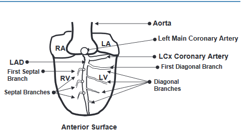
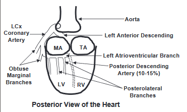
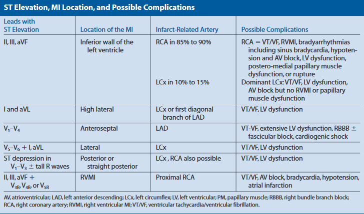

# ACUTE CORONARY SYNDROME

- maximum time of viability - 6hours 

## ANATOMY

### LAD 
- **proximal LAD**
	- v1 - v4 (anteroseptal, I, avl(high lateral - due to first diagonal branch block)
	- if lad is long ie wraps around the apex - II, III, aVF
	- complete RBBB may occur
- **distal to first diagonal and first septal branch**
	- v2-v4  

### LCx

- anterolateral mi - I avl or v5, v6
- posterolateral mi - v7, v8, v9
- inferior mi in 15% if LCx is dominant (elevation lead 2>3, depression V2, V3)
- in 15% of patients the LCx is the **dominant artery (gives rise to the posterior dominant artery) - supplies the AV Node** 

### RCA

- **dominant in 85% - gives rise to AV node and PDA**
- inferior mi (elevation lead 3>2, depression avl > 1)
- inferolateral mi
- inferoposterior mi
- rvmi (3r-6r) - only in rca
## ECG:

- changes seen in ecg before microscope and cardiac troponins 
- ecg + cardiac markers within 10 mins - **door to paper time - 10 mins** (my nomenclature) 
- st elevation from cornary vasospasm - no cellular necrosis (reversed with ntg)
- st elevation - complete occlusion
- st depression or t wave inversion - incomplete occlusion
	- cellular necrosis(inc enzymes) - NSTEMI
	- no cellular necrosis - unstable angina    

### Complete Occlusion

1. peaked or hyperacute T waves  (first to occur before st elevation)
2. st elevation >1mm- various morphologies - tombstone pattern most grave prognosis 
3. dec in size of r waves and t wave changes(eg. depression)
4. reciprocal st depression - distinguishes it from other causes of st elevation 
5. pathological q waves indicate  permanent transmural damage (normal or septal q waves may be seen in leads v5, v6 and leads I and avl, normal non septal q waves may occur in leads III)
> NOTE: differential for pathoogical q waves(>0.03s, in two contiguous leads, >1mm deep):  transmural   MI,idiopathic   hyper-trophic  subaortic  cardiomyopathy/stenosis,  LVH,  abnormalactivation  of  the  ventricles  from  WPW  syndrome,LBBB  and  fascicular  blocks,  myocardial  scarringfrom cardiomyopathy, infiltrative disease involvingthe  myocardium, or  when  the  rhythm  is  ectopic  orpacemaker induced. q wave not a contraindication for reperfusion 

### Differential for ST elevation

- Normal  elevation  of  the  ST  segment  at  the  transition zone - usually seen in v2-v5, no reciprocal changes
- Early repolarization - st segment <25% of T wave in v6, tachy lowers st and brady accentuates st segment
- LBBB - qrs and st discordant (with mi - concordant)
- Left ventricular hypertrophy (LVH) - st and t discordant
- Acute pericarditis - diffuse st segment involving all leads >25% of t wave in v6, reciprocal st depression in only v1 and avr, depression of the pr segment, no q waves - st elevation lasts for 1 week followed by t wave inversion which lasts for 1 more week
- Left ventricular aneurysm - *if st elevation(becomes permanent) doesnt resolve after acute mi suggests left ventricular aneurysm*, *st elevation in q wave leads*, t inverted 
- Electrolyte abnormalities: hyperkalemia (at serum k+ >8 mEq/L and hypercalcemia
- Wolff-Parkinson-White (WPW) syndrome
- Osborn wave of hypothermia - j point elevation in the shape of letter h (Osborn wave)
- Brugada ECG
- Others:   Pacemaker   rhythm,   ectopic   ventricular complexes, Takotsubo  cardiomyopathy (inc cardiac markers, ballooning of the antero-apical left ventricular wall, compensatory hyperkinesis of the basal segments -- causes myocardial stunning due to severe vasospasm, excessive sympathetic stimulation, micro circulatory dysfunction), tumors  or trauma involving the ventricles

## Treatment 
 
### Medical:
1. ntg 0.4 mg 5 mins (not for right ventricular infarction)
2. aspirin loading dose
3. clopidogrel loading dose
4. fentanyl/morphine(doc)/dilaudid for pain
5. statins
6. ace/arb?
7. beta blocker
8. heparin

### Thrombolytic Therapy:
- **Criteria:**
	- st elevation > 1mm in any 2 or more adjacent precordial limb leads 
	> ST elevation is measured at the J point. The J point  is  the  junction  between  the  terminal portion of the QRS complex and beginning of the  ST  segment. The  preceding  T-P  segment serves as baseline for measuring the ST elevation. The  PR  interval  is  used  if  the  T-P  segment is too short or is obscured by a U wave or a P wave of sinus tachycardia
	>
	> - new onset LBBB 	
- **Time Limit:**
	- up to 12 hours after symptom onset 
	- up to 24 hours if symptoms persist or stuttering chest pain (waxing and waning and st segments remain elevated)
	- door to needle time 30 mins
- **Contraindication:**
	- st depression even if cardiac markers are elevated
	- t wave inversion even if cardiac markers are elvated
- **Signs of success** 
	
	- st back to normal
	- t wave inversion
	- accelerated idioventricular rhythm 
	- resolution of chest pain
- **Failure:** if st elevation doesnt come down after 90 mins pci should be used 

### PCI
- door to balloon time - 90 mins 
- best results if done within 2 hours of symptoms 
- resolves symptoms regardless of the duration of symptoms 
- **contraindications**
	- intracranial hemorrhage
	- known structural cerebrovascular lesions (av malformation
	-  malignant intracranial neoplasm
	-  ischemic stroke wihtin 3 months, 
	-  aortic dissection
	-  active bleeding
	-  bleeding diathesis other than menses
	-  significant head or facial trauma within 3 months 
- **relative contraindication**
	- chronic poorly controlled hypertension
	- TO BE COMPLETED

## COMPLICATIONS

1. VT/VF: most common with ant mi (can occur in any mi)
2. bradyarrhythmias (sinus mi and av block) - inf mi
3. RBBB - common in anterior mi (with or without fascicular block, infranodal, at the level of bundle of His or athe the level of bundle branches)
4. LBBB - difficult to distinguish from MI 
