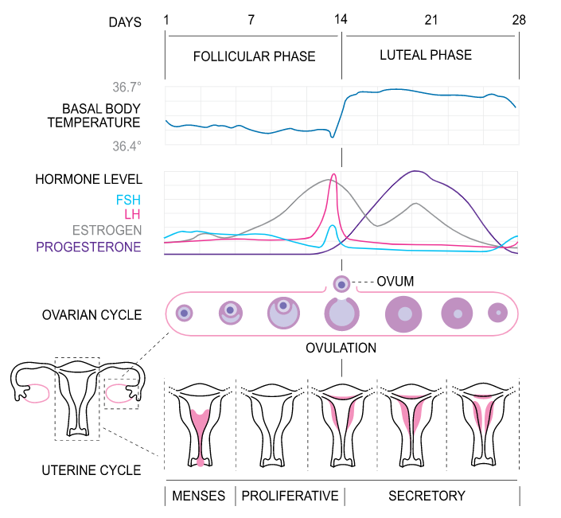
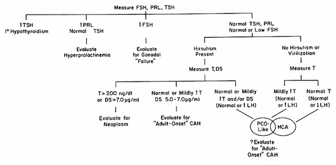

# AMENORRHEA
[reference](https://www.ncbi.nlm.nih.gov/books/NBK279144/)

Not menstruating for gt 3 months 

## CAUSES

1. anatomical incl. pregnancy
2. ovarian
3. chronic anovulation - m/c cause of amenorrhea in the reproductive age 

## INVESTIGATIONS

1. FSH - inc ovatian failure
2. TSH - hypo/hyperthyroidism
3. Prolactin - inc hyperprolactinemia
4. Testosterone - virilizing tumours, adult onset cah
5. LH - inc with normal test - PCOS, dec LH with normal test - HCA (hypothalamic chronic anovulation)

## TREATMENT 

1. POF- oc pills 
2. HCA(chronic anovulation) - oc pills
  - in women desiring pregnancy: pulsatine GnRH - clomiphene - LH should be given for ovulation induction
