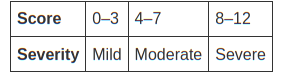

# ASTHMA
- chronic inflammatory disease of the airway associated with reversible(either sopnstaneously or medications) airway hyperresponsiveness  
- potential triggers allergens(house dust mites, cockroach residue, animal dander, mould, pollen) ,nonallergens (viralinfections, tobacco smoke, cold air, exercise)
recurrent episodes of wheezing, breathlessness, chest tightness, coughing - of varying timimng and intensity

### Pathophysiology

    =>allergens    =>=>  
                   =>=>Th2(thelper cell2) => cytokoines(IL4,6,9,13) => eosinophi and ige =>             
             		     inflammatory mediators(histamine, cycteinyl leukotrienes) => 
             		     bronchospasm edema inc. mucous secretion (asthma)
    =>nonallergens =>=>

    early phase => late pahse => repeats => airway remodelling 

### Risk Factors 
- Prenatal - maternal smoking, antibiotic intake, nsaid use(ibuprofen, diclofenac > paracetamol), c section, 
- protected by(fish intake, vitaminE and zinc intake)

- Childhood - allergen sensitisation, antibiotic usage, decreased lung function, tobacco smoke exposure, prolonged breastfeeding

### Phenotypes of Asthma
**WIP**

### Diagnostic Criteria!

- Spirometry objective method of diagnosis in >6yrs
- PEF next alternative - only used in adults  
- If spirometry normal but symptoms present measure airway responsiveness by bronchoprovocation
  - direct airway challenge - give methacholine/histmaine - measured as provocative dose/concentration (PD20/PC20) - dose at which fev1 drops by 20%
  - contraindication - fev1 < 60%, hypertension, recent stroke, recent mi 
  - indirect - mannitol/exercise

- avoid iecs or laba 24hrs before all above tests  

The most useful method of diagnosis in children with asthma is a trial of rx (8-12 weeks of daily ICS and short acting bronchodilator as rescue medication) coz most children develop wheeze only during viral infection and remain asymptommatic inbetween -- If the trial reduced symptoms a diagnosis of asthma is likely.

Another method of diagnosis when child comes with symptoms is giving rescue bronchodilator and assessing improvement 10-15 mins later -- improvement suggests asthma likely

Use **modified Asthma Predictive Tool (mAPI)** for diagnosis of children < 3yrs with recurrent wheeze -- positive mAPI in preschool shows asthma may continue in future  

**NON INVASIVE AIRWAY TESTS**
* sputum esoinophils 
* exhaled nitric oxide levels(produced by cells during inflammatory process)
* allergic skin testing 
 

### Physical Examination

* Wheezing
* prolonged expiratory phase
* children:
	* repeated cough
* reversibility of symptoms after bronchodilators
* skin - atopic dermatitis
* nose - allergic rhinitis, nasal polyps(also seen in cystic fibrosis)
* PRAM(Pediatric Respiratory Assessment Measure) - used to assess acute asthma severity - use in children 0-17 years in ED 

### Differential Diagnosis

**Adults** 
* COPD
* bronchitis
* GERD 
* recurrent respiratory infections 
* heart disease 
* vocal cord dynfunction

asthma and copd can coexist as Asthma-COPD Overlap Syndrome (ACOS)

**Children**
* Infections 
 * Chronic rhinosinusitis
 * recurrent uti
 * tuberculosis
* Congenital 
 * Tracheomalacia
 * Tracheoesophagel fistula
 * cystic fibrosis
 * bronchopulmonary fistula
 * primary ciliary dyskinesia
 * immune deficiency 
 * congential heart disease
* Mechanical Problems
 * Foreign body aspiration
 * gerd
 * vocal cord dysfunction

### Management

**Controller therapy**
* ics
* laba
* lama(long acting muscranic receptor andtagonists) - not indicated in persons < 18
* ltra(leukotriene receptor antagonist)
* biological(anti IgE and anti IL5)
* allergen specific iv immunotherapy
* oral prednisolone

**medication can be stepped down after 2 weeks if symptoms were controlled**

**Reliever Therapy**
* short acting beta agonis
 * used as standalone only when symptoms less than twice per month wihtout nocturnal awakening or no exacerbation in the past year
 * otherwise always accompanied by controller medication 
 * use anticholinergics as second line to saba if saba not available
* inhaled anticholinergics 
 * used along with saba for exacerbations
 * second line as reliever therapy
 * not used in children
* systemic corticosteroids

**Inhaler Devices**
* pMDI presurised Meterred Dose Inhaler
 * with spacer and mask - children 2-4 years of age
 * with spacer and mouthpiece 4-6yrs of age or if child able to form a seal around the mounthpiece
* Dry Powder Inhaler - adults and children > 6yrs of age

### Individual Drugs 

**WIP**
