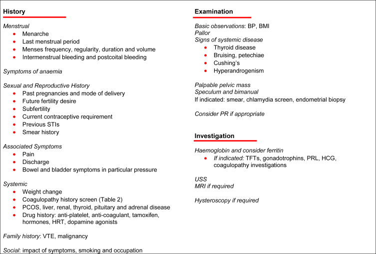
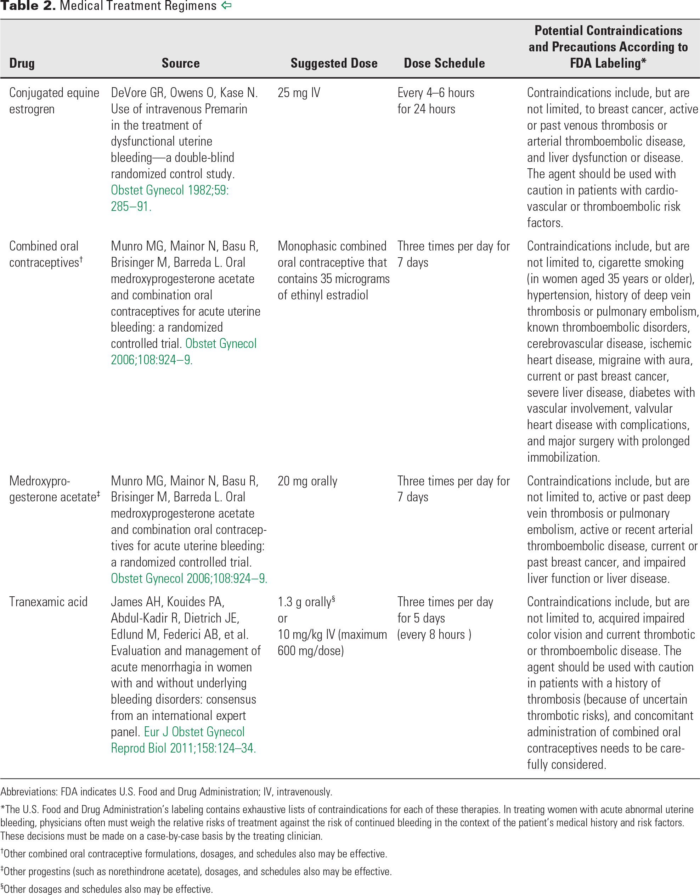
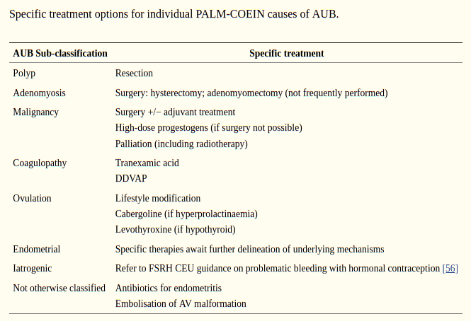

# ABNORMAL UTERINE BLEEDING
[Reference ncbi-basic-stuff](https://www.ncbi.nlm.nih.gov/books/NBK532913/)
[Reference acog- acute HMB](https://www.acog.org/clinical/clinical-guidance/committee-opinion/articles/2013/04/management-of-acute-abnormal-uterine-bleeding-in-nonpregnant-reproductive-aged-women)
[Reference ncbi-figo-classification](https://www.ncbi.nlm.nih.gov/pmc/articles/PMC4970656/)
<a href='./aub_coagulation_history_screening.png' id=pic>Coagulation-Screening-Tool</a>

falling progesterone levels leads to shedding of the decidua functionalis layer causing uterine bleeding 
increased pgf2 alpha causes constriction of blood vessels also leading to shedding 

normal menstrual freqency - 24-38 days 
normal frequency variation can be +/- 2 to 20 days 
duration of menses can be from 4 to 9 days
normal volume is 5 to 80 ml - can be measured by 
  * PBAC - Pictorial Blood-loss Assessment Chart 
  * Menstrual Pictogram *(Preferred)* 
amenorrhea - absent menstrual bleeding for > 6 months 

chronic aub etiologies are classified by FIGO as PALM COEIN

> NOTE: 13% of women with heavy menstrual bleeding have vW disease and 20 of women with HMB have some coagulation disorder
<a href='#pic'>Screening questions for coagulation disorders: </a> 
> * HMB since menarche
> * one of a. pph, b. sx related bleeding, c. bleeding assosicated with dental work
> * two or more of a. easy bruising, b. epistaxis once or twice per month c. frequent gum bleeding d. familiy history of bleeding
> if above positive do labs - vW-ristocetin cofactor activity, vW factor antigen, factor viii

## HISTORY TAKING

## INVESTIGATIONS:

coagulation disorders: pt, ptt, aptt, fibrinogen, 
vW disease:  vW-ristocetin cofactor activity, vW factor antigen, factor viii
endometrial tissue sampling for HMB women >45 yrs old - endometrial cancer is the most common gynacological cancer in the west  
endometrial tissue sampling for women <45yrs old unopposed estrogen exposure present eg.pcos, failed medical management, persistent aub
anovulatory aub(aub-o) - [tests for pcos](../pcos.md "LAB AND DIAGNOSIS"), thyroid function test, prolactin levels, serum progesterone levels 
inv for liver disorders
inv for sepsis or infection like chlamydia trachomatis 
inv for leukemia 
anemia profile 

## TREATMENT:

### **ACUTE AUB:**
- iv conjugated equine estrogen- iv premarin 25mg q4h *(preferred)* - bleeding arrest within 8hrs
iv tranexamic acid 10mg/kg q8h 
- combined oral contraceptives - tid x 7days followed by od x 21 days - bleeding arrest within 3 days *(oestradiol valerate with dienogest quadriphasic pill > ethinyloestradiol and levonorgestrel)* 
- oral medroxy progesterone acetate - 60-120mg stat, 20mg tid x 7days, 20mg od x 21 days -  bleeding arrest within 3 days 
- tranexamic acid - effective for treatment of acute and chronic aub - 1300mg tid || 2-3g/d tid - reduces bleeding by 50%, also reduces intraoperative bleeding 
- desmopressin for vW disease - intransal, iv or sc (risk of fluid retention and hyponatremia present so be cautious as to avoid retention in pts receiving iv fluid resuscitation)
- recombinant factor viii and recombinant vW facctor - coagulation defects and vW disease
- factor specific replacement

 

### Failed Medical Management - 
- intrauterine tamponade with 26F foley with 30mL of saline solution
- hysteroscopy guided removal of target lesion
- hysteroscopy with curettage
- uterine artery occlusion or embolisation
- endomtrial ablation
- hysterectomy total or supracervical

*Followup after arrest of initial bleeding
- oc pills
  - combined
  - progestins
- tranexamic acid alone or in combination with nsaids eg.mefanamic acid (tranexamic acid+mefanamic acid - only non contraceptive treatment options)*

> NOTE: anticoagulant therapy and antiplatelet therapy is considered AUB-C rather than AUB-I
> NOTE: drugs that change the HPO axis eg. dopamine also come under AUB-O rather than AUB-I
> NOTE: AUB-I includes - oestrogen/progesterone therapy, GnRH agonists, aromatase inhibitors, SERM, SPRM

**CHRONIC AUB**

