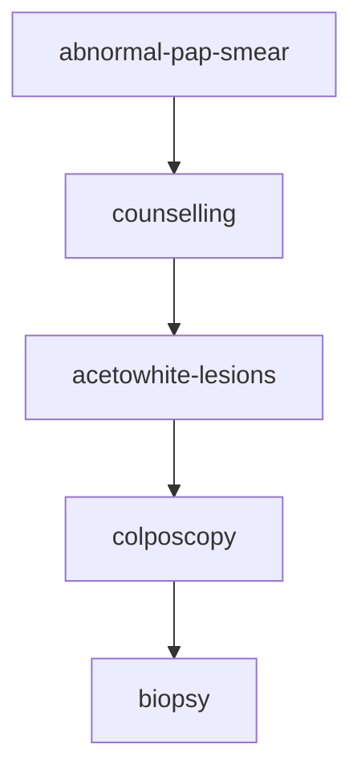

# CERVICAL CANCER 

[Colposcopy](https://www.ncbi.nlm.nih.gov/pmc/articles/PMC5780303/)

breast cancer > colorectal > cervical 
3rd most common cancer site in women 
7th most common cancer site in humans 

## RISK FACTORS 
* sexual history 
  * age at first intercourse 
  * number of partners 
  * sexual behaviour of male partners 
  * presence of penile cancer in partner 
* tobacco 
* high parity 
* oral contraceptive use (debatable)
* hpv - most common std in 2018 - causes 99% of cervical cancers
  * 16,18 carcinogenic 
  * 31,33 probably carcinogenic 
  * 6,11 possibly carcinogenic 
* co infection of hpv with other organisms increases risk 

## HISTORY AND EXAMINATION 
* sexual history 
* history of genital infections inc hiv 
* smoking history 
* hpv vaccination 
* aub - intermenstrual bleeding, postcoital bleeding 
* vaginal discharge

## TREATMENT AND MANAGEMENT 
* low grade cin < 25 years spontaeously resolves 
* high grade treat 
* cryo or excision for small size and depth 
* conization or leep for lesions that include the endocervical canal or extensive lesions 
* cancer  

## SCREENING(SECONDARY PREVENTION) 
* not necessary for <21 and grt than 65 yrs (with adequate neg prev screens)
* Pap smear + HPV DNA is the screen of choice
* HPV DNA alone might be enough  
* women 21-29 should be screened every 3 yrs 
* women 30 to 65 should be screened once in 5 years 
* hpv dna testing negative predictive value is 99%
* via sensitivity 77% and specificity 86%
* [Colposcopy Nomenclature](./colposcopy_nomenclature.pdf)

Colposcopy is usually followed by biopsy of 2-4 sites - increases the sensitivity of the test 
Biopsy from an apparently normal site may also be done further increasing the sensitivity

## VACCINATION
Gardasil - qaudrivalent 16,18,6,11
Cervarix - bivalent 6,11
3 doses - 0.5ml each im 
girls should be vaccinated as early as 9-13 years before first coitus 
upper limit for vaccination 25 years 

