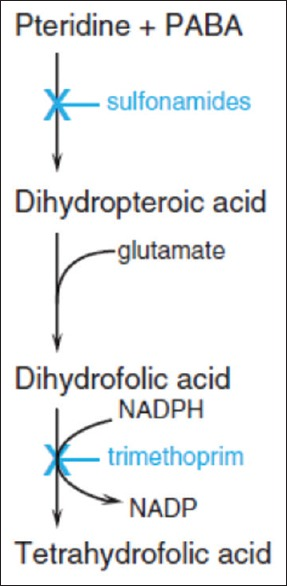

# COTRIMOXAZOLE (CTX)

[ctx in the icu](Reference: https://www.ncbi.nlm.nih.gov/pmc/articles/PMC4031607/ )
[malaria and ctx](https://www.ncbi.nlm.nih.gov/pmc/articles/PMC3579948/)

## Mechanism of Action

* smx - inhibit dihydrpteroate synthase
* tmp - inhibits dihydrofolate reductase - synergistic effect 
* effective ratio tmp:smx - 20:1 for oral and 5:1 for iv
* good oral absorption
* peak levels 2-6hrs 
* reach 50-80% of serum conc in body fluids
* readily enters csf
* sodium salts of sulphonamides are soluble in water 
* renal excretion
* tmp renal clearance inc with acidic urine

## Spectrum of Action
* wide(broad) spectrum antibiotic
* good soft tissue and csf penetration
* g+ and g-

## specific organisms 
* conc dependent afction vs staph aureus
* conc dependent action vs e.coli
* s.chromogenes(gram postive coagulase negative staph causing bovine mastitis)
* stenotrophomonas spp.(Gram-negative rod-shaped, nonspore forming, nonacid-fast facultative aerobes)
* bcide first then bstatic - burkholderia pseudomallei
* bstatic - nocardia
* pneumocyctic jovenii
* sterotrophomonas maltophilia
* mrsa
* esbl enterobacteriaceae

## Uses
* uncomplicated lower uti
* acute exacerbation of chronic bronchitis 
* shigellosis
* prohylaxis for pneumocystitis jirovice and toxoplasma gondi in HIV with cd4<350/mm3
* rx of f.malaria in [HIV,nonHIV]  pts and also for prophylaxis but no gametocidal/sporocidal action - dosage:8mg/kg tmp	

## Adverse effects 
* generally very safe
* Bone marrow suppression
* Hypersensitivity reactions like neutropenia, Stevens-Johnson syndrome (SJS) and Sweet’s syndrome occur more often in HIV/AIDs patients(The reactions in this group have been related to their poor ability to handle nitroso-derivatives of sulfamethoxazole) 
* fixed drug eruptions (causing ulcers in the genitals, face, sacral skin, acra(limsb)l skin)

## Dosing 

For patients with Pneumocystis jovenii, Stenotrophomonas maltophilia, Burkholderia pseudomallei or Nocardia spp. infection - 15 mg/kg/day TMP IV or PO (with corresponding 75 mg/kg/day SMX).

For methicillin-resistant Staphylococcus aureus (MRSA) or extended-spectrum β-lactamase-producing (ESBL) Enterobacteriaceae - 160 mg TMP IV or PO twice daily (with corresponding 800 mg SMX).

> Note: malaria prophylaxis - Slufadoxine Pyrimethamine - Intermittent Preventive Therapy(SP-IPT) 
> other alternatives- CTX, mefloquine, dihydroartemisinin-piperaquine, Chloroquine-azithromycin, SP-azythromycin

> Note: most common organism in some ICUs acinetobacter baumanni - responds to only colistin or tigecycline...now resistance to tmpsmx is decreasing

