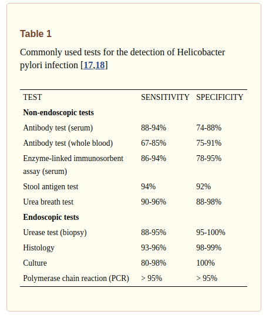
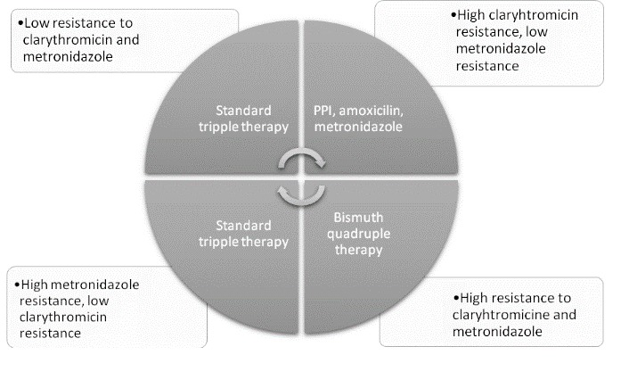
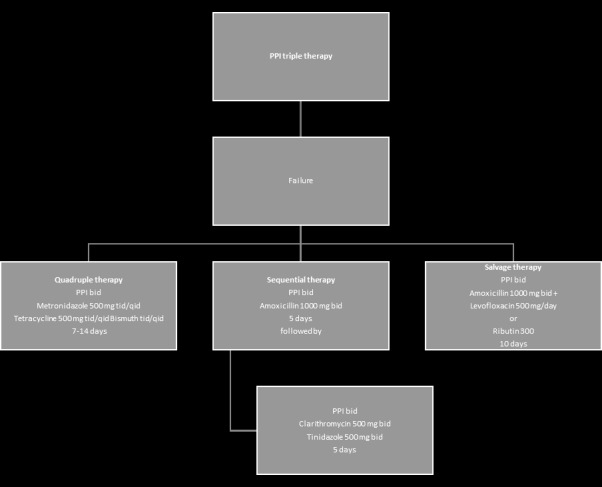

# HELICOBACTER PYLORI
[reference](https://www.ncbi.nlm.nih.gov/pmc/articles/PMC5467250/)

- maybe present in more than half of the world population
- infects the stomach during childhood
- communicalble through saliva, vomit or fecal matter
- faculatative intracellular bacterium of innate immune cells capable of interfering with the phagosome maturation 
- risk for gastric ca, along with EBV

## CLINICAL FEATURES

- **asymptomatic gastritis**
- **gastrointestinal malignancy**
- **ulcers**
	- dudoenal ulcers - 95% 
	- gastric ulcers - 5%

> NOTE: 50% of gastric ulcers and 80% of duodenal ulcers are associated with infection and eradication reduces the risk of ulcer recurrence

- infection -> acute gastritis -> hypochlorhydria -> chronic active gastritis of antrum- 95%(inc acid secretion and duodenal ulcer), corpus- 5% (gastric atrophy and achlorhydria) or both (so hpylori can cause both inc and dec acid secretion)

- **MALT**(low grade b cell marginal zone lymphoma) - hpylori(75% association) - [group 1 carcinogen](https://monographs.iarc.who.int/agents-classified-by-the-iarc/) - if detected early complete remission with antibacterial rx

- **gastric adenocarcinoma** - repeated gastritis - atrophy - intestinal metaplasia - dysplasia - carcinoma

> NOTE: alarm signs of [dyspepsia](https://www.ncbi.nlm.nih.gov/books/NBK554563/) (fam h/o proximal gastrointestinal cancer, gi bleed, odynophagia, progressive dysphagia, unexplained iron def anemia, unintentional wt loss, persistent vomiting, palpable mass, lymphadenopathy, jaundice)

- 20 to 60% of pts with [functional dyspepsia](https://www.ncbi.nlm.nih.gov/books/NBK554563/) have hpylori infection - and eradication results in symptomatic benefit in 10% of these patients 

- pts <55 who have new-onset dyspepsia without alarm features should undergo Hpylori testing and treatment

- **hpylori reduced serum ferritin and iron levels in cad thus acting as an independent risk factor** 

- also has a role in ITP, iron deficiency anemia, b12 deficiency, pre eclampsia

## INVESTIGATION

- UBT (urea breath test) - 10-20 mins after swallowing a capsule containing urea, a breath sample is collected and analyzed for labeled co2 - positive test signifies active infection - turns negative after eradication - so used to test eradication(ppi, antibiotic, bismuth reduce urea production so should be held before test)
- endoscopy - test for inflammation and ulcers, biopsy can be taken for culture
- stool sample - antibody test - can be used to test eradication

## TREATMENT

- should be give to all pts with hpylori, malt lymphomas
- capable of developing resistance so 2/more antibiotics used together with ppi and/or bismuth containing compounds.
- pts who have already taken metro and clarythro/erythro have resistance for these antibiotics

- confirm eradication with ubt/stool antigen test 4 weeks after completion of therapy

triple therapy(ppi, amox, cla) -> resistance to cla -> switch to metro(ppi, amox, metro) -> resistance to metro -> quadruple therapy(ppi,bismuth,metro,tetra) -> failure -> sequential therapy(ppi, amox first 4 days, then ppi, cla/tinidazole for 5days) -> failure -> salvage therapy (ppi, amox, levo)
