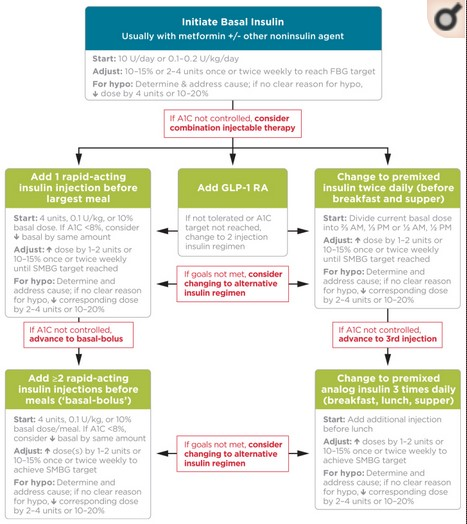
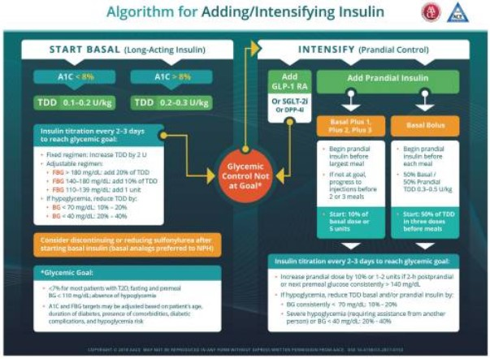

# INSULIN

[reference](https://www.ncbi.nlm.nih.gov/pmc/articles/PMC6528396/)

[to read...basal bolus vs premixed](https://care.diabetesjournals.org/content/36/Supplement_2/S212)

[to read...insulin resistance](https://www.ncbi.nlm.nih.gov/pmc/articles/PMC1204764/)

[to read...dose adjustments](https://www.ncbi.nlm.nih.gov/books/NBK278938/)

## USES

- diabetes melitus
- hyperkalemia
- hypertriglyceridemia
- diabetic ketoacidosis/hyperosmolar hyperglycemic state

## MECHANISM OF ACTION
- stores excess energy in the fed state
- promotes 
	- glycogen synthesis
	- lipid synthesis
	- protein synthesis
	- dna synthesis
	- cellular growth
	- differentiation

food -> preproinsulin from beta cells -> proinsulin -> insulin with a b c peptide units -> binds to receptor(alpha and beta subunit with tyrosine kinase enzyme) -> binds to alpha subunit -> phosphorylation and activation of the target protein by tyr kinase leading to many effects on cellular metabolism + inc expressin of GLUT to the membrane surface and promotes entry of glucose intracellularly -> glucose converted to glycogen for storage, formation of acetyl coa and TAG(deposited in adipose tissue), amino acid used for protein synthesis 

## TYPES OF INSULIN ANALOGUES
| name                           | onset     | peak        | duration | remarks                    |
|--------------------------------|-----------|-------------|----------|----------------------------|
| rapid (lispro, aspart)         | 30 mins   | 1 hr        | 5hrs     | so use postprandially      |
| short                          | 30-60 min | 2-4 hrs     | 8hrs     | so use 30 mins before meal |
| intermediate (nph, lente)      | 1-2 hrs   | 6-10 hours  | 16 hours |                            |
| long acting (detemir, glargine, degludec) | 2 hours   | 6-20 hours  | 36 hours |                            |

## ROUTES OF ADMINISTRATION

- iv bolus, infusion
- subcutaneous, continuous subcut infusion
- IM
- inhalational
- oral (trails)
- transdermal (trials)

## ADVERSE EFFECTS

- allergy
- dermal lipodystrophy
- hypoglycemia
- long term use - ab against insulin leading to insulin resistance
- hypokalemia - manifesting as cardiac arrhythmia, muscle cramping, gi upset, confusion, weakness, lethargy

## CONTRAINDICATIONS
- allergy
- hypokalemia (relative - correct then administer insulin)

## TITRATION

## REGIMEN - ADA

### BASAL INSULIN
- 1st gen - intermediate (NPH) **less preferable**
- 2nd gen - long acting (glargine, detemir, degludec) - **preferred**
> NOTE: DEGLUDEC binds to albumin so longer duration of action

Initiation dose (recommended by American diabetes association) **10 units/day or 0.1-0.2 units/kg/day, adjusted 10-15% or 2-4 units once or twice weekly** to reach target fasting glucose in pts 
- whose HbA1c remains uncontrolled after >3 months of triple combination therapy
- whose A1C is >10%
- whose blood glucose is >300mg/dl 
- who are symptomatic of hyperglycemia

### REGIMEN 1 - BASAL BOLUS REGIMEN
rapid acting before meal with greatest carbohydrate content, if target not met - progress to two or more rapid acting acting insulin injections
### REGIMEN 2 - GLP1 
add glp1 receptor agonist - if not tolerated or target not met, discontinue and switch to regimen 1 or 4
### REGIMEN 3 - PREMIXED REGIMEN
premixed insulin at 75/25, 70/30 or 50/50 mix bd or tds...basal insulin and glp -1 receptor agonist discontinued

## REGIMEN AACE

> NOTE: best policy to start insulin - fix fasting first

**SIGNS OF OVERBASALISATION**
- fasting glucose <70mg/dl
- beam >50mg/dl (diff bt bedtime and next day morning glucose)
- basal dose >0.5 units/kg