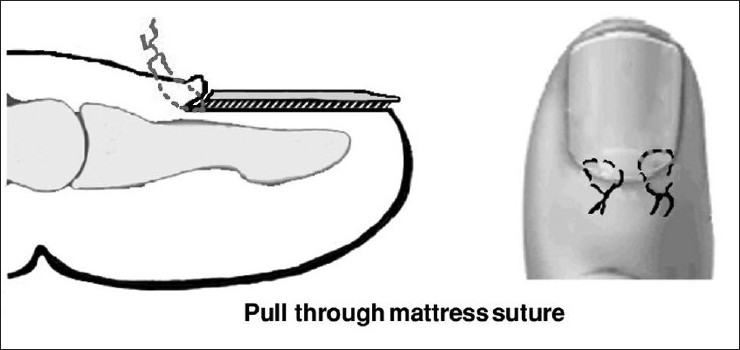

# NAIL INJURIES
[Reference](https://www.ncbi.nlm.nih.gov/pmc/articles/PMC3193631/)

TYPES: 

1. CLOSED: *nail plate intact*
	- Subungual hematoma: 
		- if no fracture and the nail is not unduly elevated or displaced - triphenation with hot wire **gt** 18g needle 
		- if xray shows fractures - remove nail, look fro lacerations, repair it using absorbable sutures (chromic catgut 6-0/7-0) - suturing itself will help reduce the fracture
		- wound starts healing in 2 weeks - until then use non-adherent dressing (alternates - nailplate, mouldable meshed titanium plate) - use splints till three weeks (volar slab or finger splint) 
		- nail grows completely in 3 months
		- nail requires 3 to 4 growth cycles to restore normal shape, volume, apprearance
		
2. OPEN: *nail plate partially or completely avulsed exposing the nailbed* - if partially avulsed remove the remaining nail plate
	- WITHOUT NAILBED LOSS 
		- remove nail plate - suture the laceration - apply volar slab
	- WITH NAILBED LOSS
		- nail bed graft from adjacent finger or from great toe (if large grafts are needed) 
	- WITH NAILBED AVULSION (nail bed intact but avulsed)
		- reattached with mattress sutures 
	- AMPUTATIONS:
		- amputated part reattached as a composite graft 
	- EPONYCHIAL LOSS: results in loss of shine of nail
		- graft from neighboring nail
