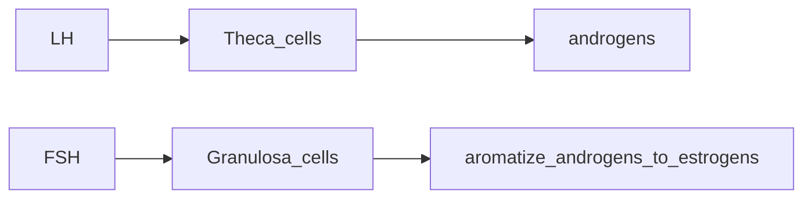

# PCOS
stein leventhal syndrome 

1. polycystic ovaries
 
2. hyperandrogenism 
    - clinical(hirsutism, acne, male pattern baldness)   
    - biochemical(inc testosterone levels)
3. oligo or amenorrhoea

***
> **NOTE:** PCOS is a diagnosis of exclusion based on NIH criteria
***

NIH criteria  2 && 3 1 need not be present(exclusion of phenocopies) #preferred

### Rotterdam Criteria 2/3 #widely accepted
    -radiological cutoff for Rotterdam criteria
    - antral follicles
        - number >25  <10mm dia per follicle
        - ovarian volume >10cm3

## Clinincal Features
physical examination - 
- balding, acne, clitoromegaly, body hair distribustion, increased skin tags - hyperandrogenemia
- hypertesion (check bp), obesity (check bmi/waist circumference), centripetal fat distribustion, acanthosis nigrans - insulin resistance 
- smoking history 

## Differential diagnosis:

1. hyperandrogenism - adult onset congenital adrenal hyperplasia, hyper prolactinemia, androgen-secreting neoplasms, exogenous androgens 
2. thyroid disorders 
3. cushings sundrome 
4. acromegaly
5. Genetic defects in insulin action (Leprechaunism, Rabson Mendenhall syndrome, Lipodystrophy)
6. HAIR-AN syndrome
7. Primary hypothalamic amenorrhea
8. Primary ovarian failure
9. acanthosis nigrans dd - insulinoma, adenocarcinoma stomach 


**The two cell two hormone hypothesis**


> NOTE: in men LH --> leydig cells --> androgens ///  FSH --> Sertoli cells --> aromatize androigen to estrogens
## LAB AND DIAGNOSIS

- baseline BMI at first visit and then at every visit to monitor weight
- waist circumference > 88 cm - centripetal obesity (NOTE: In males waist circumference > 100 cm is centripetal obesity)
- blood sugars - first ppbs inc then fbs inc - coz hyperinsulinemia compensating for insulin resistance not able to compensate pp sugars
- lipid profile 
- usg - polycystic ovaries and endometrium
- to rule out dd 
	- tft - thyroid disorders, 
	- prolactin levels - hyperprolactinemia, 
	- fasting level 17-hydroxyprogesterone taken during non luteal part of the menstrual cycle < 2 ng normal > 4 ng - late onset congenital adrenal hyperplasia(due to 21 hydroxylase deficiency) 
	- acth stimulation test - to confirm late onset congenital adrenal hyperplasia
	- androgen levels (testosterone > 2 ng and dheas > 700 mic) - androgen secreting tumours  
	- fasting insuline levels - cause of insulin resistance and hyperandrogenism
	- 24 hour urinary free cortisol - if stigmata of cushings present 
	- gonadotropin determination to rule out other cuases of amenorrhoea
> NOTE: urinary cotinine levels to detect smoking/nicotine usage
 
## CLINICAL SEQUELAE	

### Infertility due to chronic anovulation

### Skin disorders 

- acne -> hirsutism -> androgenic alopecia
- acanthosis nigrans - due to insulin resistance

### Gynaecological Cancers 
- endometrial cancer 

### Sleep apnoea 
### NAFLD
### type 2 dm
> NOTE: IGT - impaired glucose tolerance is 2hr sample after 75g glucose 140-199
> IFG -  impaired fasting glucose is the fasting sample of 100 - 125
> treatment of igt and ifg - life style modifications, drugs(metformin, acarbose)

> OHSS - follows treatment  with menotropins
> syndrome of  
> 1. massive enlargement of the ovaries 
> 2. development of rapid and symptomatic ascites
> 3. intravascular contraction
> 4. hypercoagulability
> 5. systemic organ dysfunction.

## Treatment:
**no cure for pcos**
- treat 2 
	- infertility and/or
	- hirsutism, obesity, menstrual disorders


**Treatment of infertility**
- 1st line - letrozone - aromatase inhibitor - acts on hypothalamus, adipose tissue, ovary
- 2nd line - clomiphene citrate(anti estrogen) - acts on hypothalamus only or clomiphene and metformin
	- one course of clomiphene
		- medroxyprogesterone to start menstruation -> clomiphene(start with 50mg upto a max of 150mg) on the 3rd-5th day of ovulation for 5days -> check for ovulation -> if no lh surge -> give hCG -> intercourse -> progesterone to support pregnancy -> pregnancy test -> if failed start next cycle 
- 3rd line - gonadotropins or ovarian surgery

**Not seeking pregnancy** 
- treat glucose intolerance if present - with metformin - also inc ovulation(debatable)   
- treat amenorrhea - with cyclical ocps and progestins (oc pills also reduces lh and causes reduction of endometrial thickness by reducing estrogen levels) 
> NOTE: oc pills with anti-androgens like cyprotenrone acetate or drospirenone are useful to treat acne and hirsutism by inc SHBG
> CAUTION: use of oc pills - prevents ovulation
> CAUTION: use of anti-androgens - teratogenic for male fetus
> UNRELATED NOTE IF OC PILL USED FOR CONTRACEPTION: if breakthrough bleeding occurs inc dose of estrogen from 20mcg to 30 then 35mcg; if using 35mcg then change the progesterone; if that doesn't work change the method of contraception  
 
```
Absolute contraindications for OCP
- < 6 weeks postpartum if breastfeeding
- Smoker over the age of 35 (≥ 15 cigarettes per day)
- Hypertension (systolic ≥ 160mm Hg or diastolic ≥ 100mm Hg)
- Current or past history of venous thromboembolism (VTE)
- Ischemic heart disease
- History of cerebrovascular accident
- Complicated valvular heart disease
- Migraine headache with focal neurological symptoms
- Breast cancer (current)
- Diabetes with retinopathy/nephropathy/neuropathy
- Severe cirrhosis
- Liver tumour (adenoma or hepatoma)

Relative Contraindications

- Smoker over the age of 35 (< 15 cigarettes per day)
- Adequately controlled hypertension
- Hypertension (systolic 140–159mm Hg,diastolic 90–99mm Hg)
- Migraine headache over the age of 35
- Currently symptomatic gallbladder disease
- Mild cirrhosis
- History of combined oral contraceptive related cholestasis
- Users of medications that may interfere with combined oral contraceptive metabolism

Protective effects of ocp
- 50% reduction of endometrial cancer 
- 27% reduction of ovarian cancer 
- 18% reduction of color cancer 

Toxicity
only symptomatic for headache flushing and thromboembolic events 
```

sleep apnoea - CPAP - improves insulin resistance, decrease sympathetic output and reduce diastolic blood pressure 
NAFLD - weight loss and insulin sensitizing therapy


