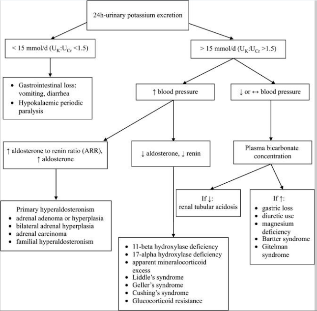

# HYPOKALEMIA
[reference](https://www.ncbi.nlm.nih.gov/pmc/articles/PMC5881435/)

potassium excretion determined by
- insulin
- catecholamines (mainly mineralocorticoids) - causes urinary exretion of k+
- urinary secretion - mineralocorticoids and distal delivery of na+ 

mineralocorticoid - na+k+ atpases in the basolateral membrane -> na+ absorbed from lumen -> electronegativity in the lumen -> k+ secreted in the lumen

> NOTE: aldosterone paradox - The ability of aldosterone to signal the kidney to stimulate salt retention without K+ secretion in volume depletion and stimulate K+ secretion without salt retention in hyperkalemia has been referred to as the aldosterone paradox

k+ absorption 
- passively in prox tubule 
- nak2cl(NKCC2) channel in the thick asc and loop of henle

k+ secretion
- cortical and outer and inner meduallary collecting duct via ROMK and maxi-K channels - secretory channels  

> NOTE:  The kidneys are far more capable in increasing than decreasing K+ excretion. As a result, inadequate intake can lead to K+ depletion and hypokalemia. Hyperkalemia usually occurs when renal excretion is impaired (glomerular filtration rate (GFR) < 20 mL/min).

## NORMAL RANGES

normal range: 3.5–5.0 mEq/L
Severe and life-threatening hypokalemia is defined when potassium levels are <2.5 mEq/L.

> NOTE: Hypokalemia associated with magnesium deficiency is often refractory to treatment with K+ 

## ETIOLOGY

* Gastrointestinal tract losses	
- Chronic diarrhea, including chronic laxative abuse and bowel diversion
- Clay (bentonite) ingestion, which binds potassium and greatly decreases absorption
- Villous adenoma of the colon, which causes massive potassium secretion (rarely)

* Intracellular shift	
- Glycogenesis during total parenteral nutrition or enteral hyperalimentation (stimulating insulin release)
- Insulin administration
- Stimulation of the sympathetic nervous system, particularly with beta 2-agonists (albuterol, terbutaline)
- Thyrotoxicosis (occasionally) due to excessive beta-sympathetic stimulation (hypokalemic thyrotoxic periodic paralysis)
- Familial periodic paralysis

* Renal potassium losses	
- Adrenal steroid excess (Cushing’s syndrome)
- Primary hyperaldosteronism
- Rare renin-secreting tumors
- Glucocorticoid-remediable congenital adrenal hyperplasia.
- Ingestion of substances such as glycyrrhizin
- Bartter syndromeGitelman syndrome Liddle syndrome
- Renal tubular acidosis Fanconi syndrome
- Hypomagnesemia

* Drugs	
- Thiazides
- Loop diuretics
- Osmotic diuretics
- Laxatives
- Amphotericin B
- Antipseudomonal penicillins (carbenicillin)
- Penicillin in high doses
- Theophylline (both acute and chronic intoxication)

## CLINICAL MANIFESTATIONS

Mild to moderate hypokalemia Severe hypokalemia	Asymptomatic or with mild symptomatology, especially in elderly people or in people suffering from heart or kidney disease
* Renal system
- Metabolic acidosis
- Rhabdomyolysis
- Hypokalemic kidney disease (tubular interstitial nephritis, nephrogenic diabetes insipidus)
* Nervous system
- Leg cramps
- Weakness and paresis
- Ascending paralysis
- Gastrointestinal system
- Constipation or intestinal paralysis
* Respiratory system
- Respiratory failure
* Cardiovascular system
- ECG changes (U waves, T wave flattening, ST-segment changes)
- Cardiac arrhythmias
- Heart failure

## EVALUATION

In general, there are two major components of the diagnostic evaluation: (a) assessment of urinary potassium excretion in order to distinguish renal potassium losses (e.g., diuretic therapy, primary aldosteronism) from other causes of hypokalemia (e.g., gastrointestinal losses, transcellular potassium shifts) and (b) assessment of acid–base status, since some causes of hypokalemia are associated with metabolic alkalosis or metabolic acidosis

## TREATMENT

The treatment of hypokalemia has four aims: (a) reduction of potassium losses, (b) replenishment of potassium stores, (c) evaluation for potential toxicities and (d) determination of the cause,

Discontinuation of laxatives, use of potassium-neutral or potassium-sparing diuretics (if diuretic therapy is required, such as in heart failure), treatment of diarrhea or vomiting, use of H2 blockers in patients with nasogastric suction and effective control of hyperglycemia, if glycosuria is present, are some measures in this direction

very 1 mEq/L decrease in serum potassium, represents a potassium deficit of approximately 200–400 mEq

2.5–3.5 mEq/L (representing mild to moderate hypokalemia), may need only oral potassium replacement.

potassium levels are less than 2.5 mEq/L, intravenous (i.v.) potassium should be given, with close follow-up, continuous ECG monitoring, and serial potassium levels measurements. 

Administration of oral potassium should be accompanied with plenty of fluid (between 100 and 250 mL of water, depending on the form of the tablet of potassium) and is better to be given with or after meals 

Regarding i.v. therapy, 0.9% sodium chloride is the preferred infusion fluid, as 5% glucose may cause transcellular shift of potassium into cells. We should prefer pre/mixed i.v. infusion

also correct serum mg
