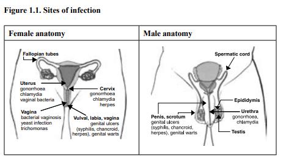
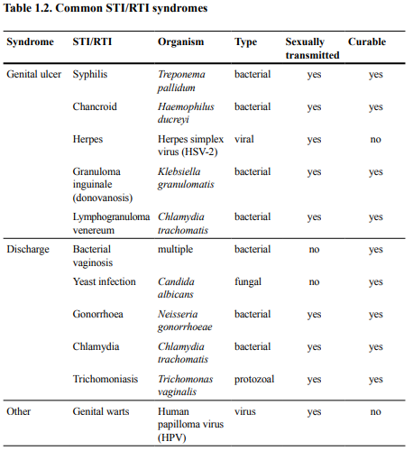
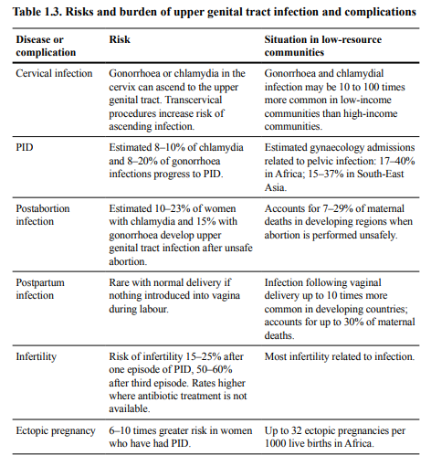
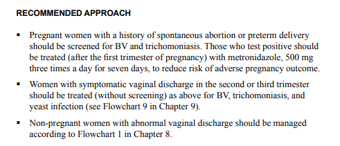

# REPRODUCTIVE TRACT INFECTIONS
[reference](http://apps.who.int/iris/bitstream/handle/10665/43116/9241592656.pdf?sequence=1)

THREE TYPES 
1. STI
2. ENDOGENOUS
3. IATROGENIC 

## CAUSATIVE ORGANISM

1. sti
	- gonorrhoea
	- chlamydia
	- syphilis
	- chancroid
	- herpes
	- trichomoniasis
	- hiv
	- genital warts
2. endogenous
	- bacterial vaginosis
	- yeast infections
3. iatrogenic
	- pid following abortion
	- iud insertion

## COMPLICATIONS

complications in pregnancy
- infection in the placenta or amniotic sac (chorioamnionitis) due to endogenous infection or sti is a major caues of late spontaneous abortion and stillbirth
- preterm labour
- preterm rupture of membranes
- congenital infection in newborn
- syphilis - repeated spontaneous abortions

other complications
- pid (lower genital tract infection reaching the upper genital tract - uterus, fallopian tube, ovaries, surroounding structures) - causes infertility, chronic pelvic pain, inc risk of ectopic pregnancy

> NOTE: GIVE 100MG DOXYCYCLINE ORALLY 1 HOUR BEFORE AND 200 MG AFTER INDUCED ABORTION TO REDUCE RATES OF IARTROGENIC STIs

endogenous yeast infection:
- common in pregnancy and women using ocp - due to changes in vaginal acidity
- common in diabetes

> NOTE: women with h/o spontaneous abortion or still birth or preterm delivery should be screened for bacterial baginosis and trichomoniasis in addition to syphilis
> NOTE: every opportunity should be taken to detect cervical infections by careful speculum examination and when possible use lab test, viavili for early cancer detection

vaginal infections 
- yeast
- bv
- trichomoniasis

almost alway symptomatic and rarely cause complications
dont treat asymptomatic cases based on microscopy findings in non pregnant women

in pregnant women with a history of spontaneous abortion or preterm delivery bv and trichomoniasis should be screened and treated - causes preterm labour, preterm rupture of membranes

- screening for bv
	- gram stain of vaginal smear 
	- wet mount to see jerky movements of motile trichomonads in 100x, look for yeast cells and trichomonads in 400x, use 10% koh to clear all cells other than yeast
	- gram stain to see lactobacilli(normal) and other bacteria like clue cells

- bv treatment 
	- metro 500mg tds for 7 days

