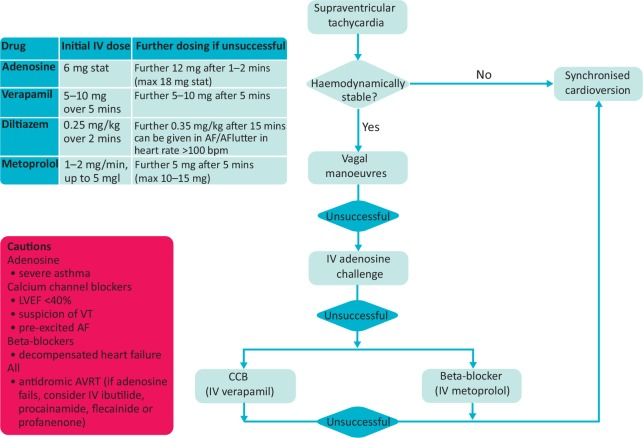

# SUPRAVENTRICULAR TACHYCARDIA

References:
[1](https://www.ncbi.nlm.nih.gov/pmc/articles/PMC6964177/)

[to be read](https://www.ncbi.nlm.nih.gov/books/NBK441972/)

[to be read 2](https://www.ncbi.nlm.nih.gov/pmc/articles/PMC4295736/)

[toberead3](https://www.ncbi.nlm.nih.gov/pmc/articles/PMC6964177/)

[psvt](https://www.ncbi.nlm.nih.gov/books/NBK507699/)

[AHA](https://www.ahajournals.org/doi/full/10.1161/cir.0000000000000311)

[LITFL - example ecgs](https://litfl.com/pre-excitation-syndromes-ecg-library/)

most common type avnrt, avrt and at
can be diagnosed with an ecg although an ecg with sinus rhythm may be needed for comparison(so never discard an ecg coz its normal)

## AVNRT
two pathways within the av node - one fast and one slow 
```
ecg features 
- p waves absent or seen as pseudo r' in v1 or pseduo s' in inf leads 
```
always inspect a previous ecg in normal sinus rhythm for better diagnosis

## AVRT
two pathways - one av node and other an embryological remnant of the connection between atria nad ventricle - called the **accessory pathway**
accessory pathways may connect from 
1. atrium to ventricle - manifest ventricular pre excitation / wpw patter
2. ventricle to atrium - concealed (clinically safe as the rate of conduction is limited by the av node)
3. both ways 

> NOTE: most accessory pathways conduct both directions with retrograde conduction seens in 15% and anterograde rarely seen

types of wpw
type a: positive delta wave in all precordial leads; r > s in V1 - left sided accessory pathway

type b: negative delta wave in v1 and v2 prominent s wave in V1- right sided accessory pathway

typess of manifest avrt
1. orthodromic - atrium to ventricle via the av node so the ap conducts the retrograde p wave(*occurs in people with concealed apthway*)
  * Rate usually 200 – 300 bpm
  * P waves may be buried in QRS complex or retrograde
  * QRS Complex usually <120 ms unless pre-existing bundle branch block, or rate-related aberrant conduction
  * QRS Alternans – phasic variation in QRS amplitude associated with AVNRT and AVRT, distinguished from electrical alternans by a normal QRS amplitude
  * T wave inversion common
  * ST segment depression 
> NOTE: orthodromic avrt is indistiguishable from avnrt - can be distinguished after reverting to sinux rhythm when slurring may be seen confirming avrt

2. antidromic - accessory pathway conducts from atria to ventricle - qrs appears broad and (rarer than orthodromic ~5% of wpw patients)
  * Rate usually 200 – 300 bpm.
  * Wide QRS complexes due to abnormal ventricular depolarisation via accessory pathway.

atrium to ventricle: 
``` 
ECG Findings:
1. short pr < 120
2. slurred onset 
3. broadening of the qrs 
```

##Treatment of AVRT

Orthodromic:
* stable 
  * vagal manuvers (valsalva 20-50% chance of revertion)
  * adenosine (should be followed by rapid saline push as the half life of adenosine is <10s)
  * ccb (verapamil in severe asthmatics)
  * dc cardioversion
* unstable 
  * synchronised dc cardioversion
  
Antidromic:
* stable 
  * amiodarone 
  * procainamide 
  * ibutilide 
  * dc cardioversion
* unstable 
  * synchronised dc cardioversion
> NOTE: Antidromic AVRT mimics VT, so if in doubt treat as VT coz treating VT as AVRT is very dangerous 
> NOTE: almost 95% of wide complex tachycardias in children are antidromic avrt and not vt 

## Pre-excited atrial fibrillation - AFib and AFlutter in WPW
Preexcitation refers to the early activation of the ventricles due to accessory pathway
afib occurs in 20% of pts with wpw and aflu in 5% of pts 

ecg of afib with wpw
* Rate > 200 bpm
* Irregular rhythm
* Wide QRS complexes due to abnormal ventricular depolarisation via accessory pathway
* QRS Complexes change in shape and morphology
* Axis remains stable unlike Polymorphic VT
ecg of aflu with wpw - same as above with regular rhythm
 
Treatment: 
* av nodal blocking agents  (adenosine, ccb, beta blockers) are contraindicated coz it may block the av node and convert it into vt or vf
* stable - procainamide, ibutilide, *dc cardioversion(preferred)*
* unstable - dc cardioversion


