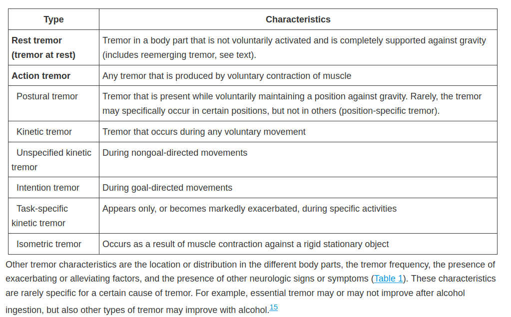

# TREMORS 

Tremor is defined as a rhythmical, involuntary oscillatory movement of a body part that is produced by alternating contractions of reciprocally innervated muscles

two types 
1. resting - parkinsons 
2. action - rest of the etiologies
