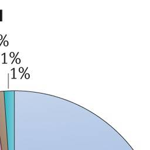

# Urinary Tract Infection

* uncomplicated
  * lower uti(cystitis) 
  * upper uti (pyelonephritis)
* complicated (UTIs associated with factors that compromise the urinary tract or host defence, including urinary obstruction, urinary retention caused by neurological disease, immunosuppression, renal failure, renal transplantation, pregnancy and the presence of foreign bodies such as calculi, indwelling catheters or other drainage devices)

> Note: 70% of the complicted utis are due to Catheter Associated UTIs (CAUTI) - risk factors include prolonged use, female gender, diabetes, older age
> Note: uti in pregnancy is complicated uti

## Causative Organism 
both gm- and gm+ and fungi cause uti 
most common organism causing uncomplicated and complicated- EnterPpathogenic EColi  (EPEC)
UPEC is followed in prevalence by Klebsiella pneumoniae, Staphylococcus saprophyticus, Enterococcus faecalis, group B Streptococcus (GBS), Proteus mirabilis, Pseudomonas aeruginosa, Staphylococcus aureus and Candida spp.

 For complicated UTIs, the order of prevalence for causative agents, following UPEC as most common, is Enterococcus spp., K. pneumoniae, Candida spp., S. aureus, P. mirabilis, P. aeruginosa and GBS

