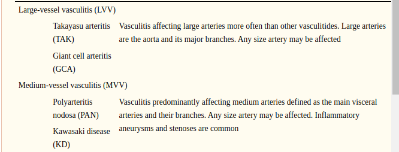
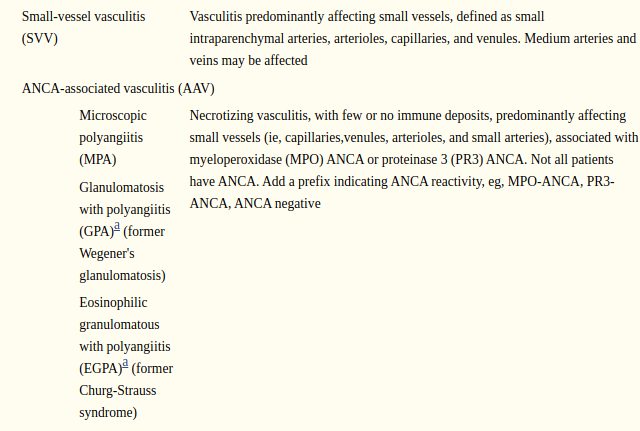
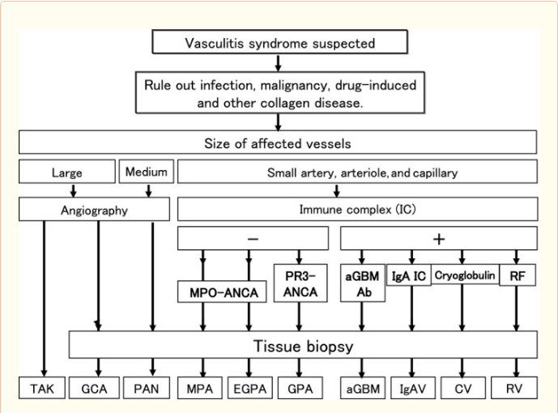
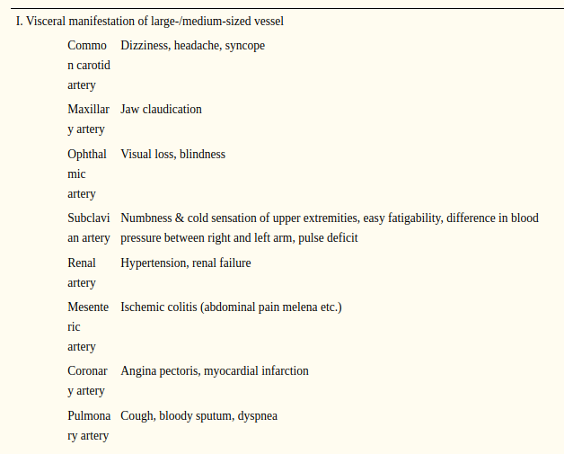
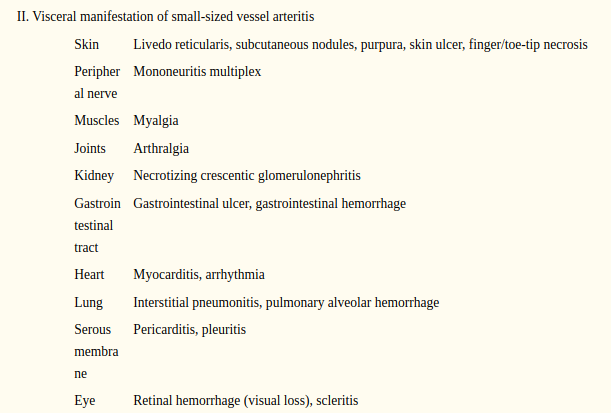

# VASCULITIS

[reference](https://www.ncbi.nlm.nih.gov/pmc/articles/PMC5689388/)
[hsp]: henoch_schonlein_purpura.md

## TYPES

1. primary vasculitis
2. secondary vasculitis

primary vasculitis classified accordikng to the size of the affected vessel

1. large vessel vasculitis LVV
	- takayasu arteritis TAK
	- giant cell arteritis GCA
2. medium vessel vasculitis MVV
	- polyarteritis nodosa PAN
	- kawasaki disease KD
3. small vessel vasculitis SMV
	- Anca associated vasculitis AAV
		* microscopic polyangitis MPA
		* granulomatosis with polyangitis GPA
		* eosinophilic granulomatosis with polyangitis EGPA
	- Immune complex vasculitis
		* Antiglomerular basement membrane disease (Anti GBM disease)
		* Cryoglobulinemic Vasculitis CV
		* [IgA vasculitis IgAV (henoch schonlein purpura)][hsp]
		* Hypocomplementemic urticarial vasculitis HUV (Anti- C1q vasculitis)
4. Variable vessel vasculitits VVV
	- behcet's disease BD
	- Cogan's syndrome CS
5. Single organ vasculitis SOV
	- Cutaneous leukocytoclastic angiitis
	- Cutaneous arteritis
	- Primary CNS vasculitis
	- Isolated aortitis 
	- others
6. Vasculitis associated with systemic disease
	- Lupus vasulitis
	- rheumatoid vasculitis
	- sarcoid vasculitis 
	- relapsing polychondritis vasculitis
	- others
7. Vasculitis associated with probable etiology
	- hep c virus associated cryoglubulinemic vasculitis
	- hepb associted vasculitis
	- syphilis associted aoritis
	- drug associated immune complesx vasculitis
	- drug associated anca associted vasculitis
	- cancer associated vasculitis
	- others

> NOTE: KD is not included in the above schematic because diagnosis of kd is solely based on clinical signs and symptoms

## DIAGNOSIS

### SYSTEMIC SIGNS/SYMPTOMS

* Fever of unknown origin (FUO): In many cases, the patient experiences a high, spiking fever of 38‐39°C.
* Weight loss caused by inflammation.
* Weakness, general malaise.
* Arthralgia, muscle pains: This systemic manifestation indicates that vasculitis has spread systemically, while localized manifestations result from insufficient supply of local blood flow caused by the inflammation of blood vessels. Histological study with biopsy is recommended in cases of localized myalgia.

> NOTE: these are the sympotoms of malignancy also. so screen for malignancies also

### LOCALIZED SIGNS/SYMPTOMS

## LABORATORY 
